# PowerShell Notes

[Learn PowerShell in a Month of Lunches (4th Edition)](https://www.manning.com/books/learn-powershell-in-a-month-of-lunches)

## Chapter 1 - Before You Begin

- **PowerShell** - refers to the 7.x version
- **Shell** - an application that can accept text-based commands, e.g., Bash or PowerShell.
- **Terminal** - an application that can run a shell application within it. Terminals are shell-agnostic, so you can run any shell in any terminal you'd like.
- **Windows PowerShell** - refers to PowerShell 5.1 that comes pre-installed on your Windows 10 device.

<table>
  <thead>
    <tr>
      <th>Command</th>
      <th>Details</th>
      <th>Page</th>
    </tr>
  </thead>
  <tbody>
    <tr>
      <td><code>$PSVersionTable</code></td>
      <td>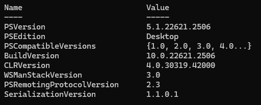</td>
      <td>33</td>
    </tr>
  </tbody>
</table>

## Chapter 2 - Meet PowerShell

<table>
  <thead>
    <tr>
      <th>Command</th>
      <th>Details</th>
      <th>Page</th>
    </tr>
  </thead>
  <tbody>
    <tr>
      <td><code>Dir /</code></td>
      <td>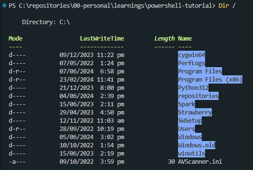</td>
      <td>49</td>
    </tr>
  </tbody>
</table>

## Chapter 3 - Using the Help System

- `Enter` - next line
- `Spacebar` - next page
- `q` - quit

<table>
  <thead>
    <tr>
      <th>Command</th>
      <th>Details</th>
      <th>Page</th>
    </tr>
  </thead>
  <tbody>
    <tr>
      <td><code>help Get-Process</code></td>
      <td>
        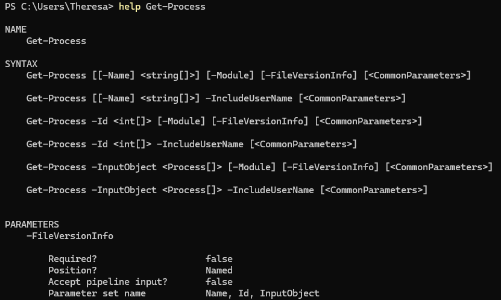
      </td>
      <td>54</td>
    </tr>
    <tr>
      <td><code>Help *event*</code></td>
      <td>
        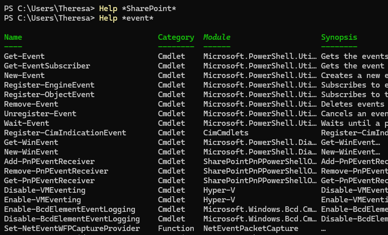
      </td>
      <td>56</td>
    </tr>
    <tr>
      <td><code>Get-Command *help*</code></td>
      <td>
        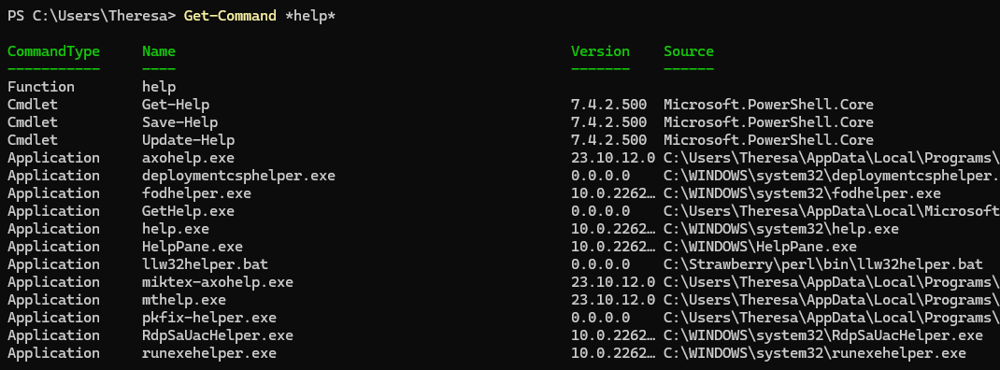
      </td>
      <td>58</td>
    </tr>
    <tr>
      <td><code>Get-Command *help* -Type cmdlet</code></td>
      <td>
        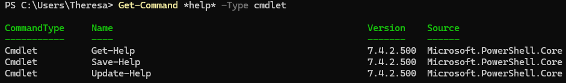
      </td>
      <td>58</td>
    </tr>
    <tr>
      <td><code>Help Get-Item -Full</code></td>
      <td>
        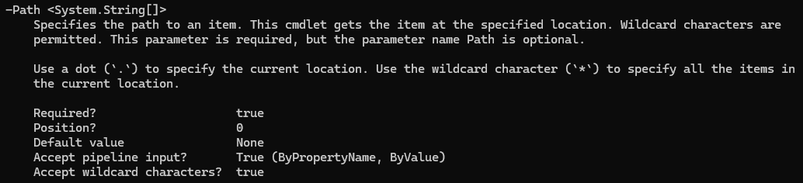
        

      </td>
      <td>61</td>
    </tr>
    <tr>
      <td><code>Get-Item [-Path] &lt;System.String[]&gt;</code></td>
      <td>
        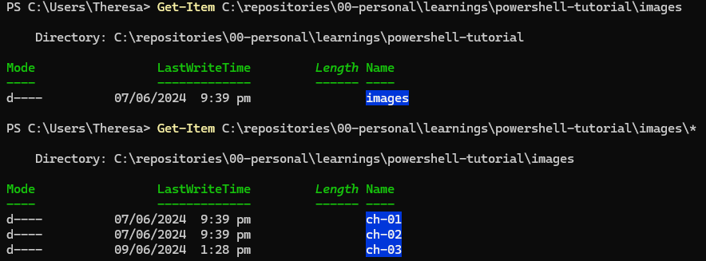
      </td>
      <td>-</td>
    </tr>
    <tr>
      <td><code>Help Get-Item -Example</code></td>
      <td>
        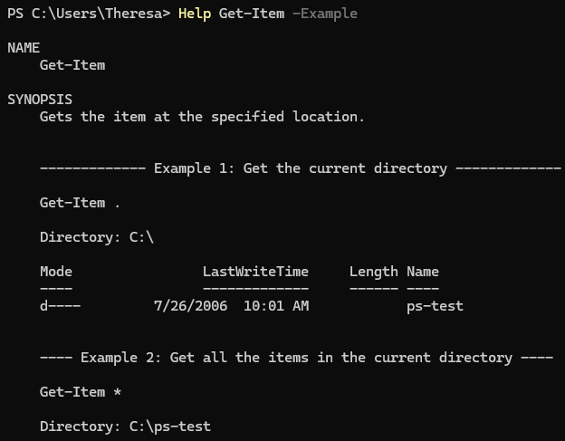
      </td>
      <td>64</td>
    </tr>
    <tr>
      <td><code>Help Get-Item -Online</code></td>
      <td>
        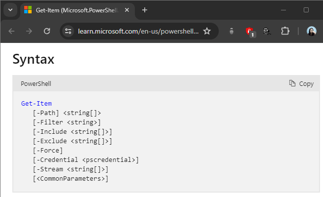
      </td>
      <td>65</td>
    </tr>
  </tbody>
</table>

## Chapter 4 - Running Commands

- A `cmdlet` is a native PowerShell command-line utility. These exists only inside PowerShell and are written in a .NET Core language.
- A `function` can be similar to a `cmdlet`, but rather than being written in a .NET language, functions are written in PowerShell's own scripting language.
- An `application` is any kind of external executable, including command-line utilities such as `ping`, and `ipconfig`.
- `Command` is the generic term that we use to refer to any or all of the preceeding terms.

<table>
  <thead>
    <tr>
      <th>Command</th>
      <th>Details</th>
      <th>Page</th>
    </tr>
  </thead>
  <tbody>
    <tr>
      <td><code>Get-ExecutionPolicy</code></td>
      <td>RemoteSigned</td>
      <td>70</td>
    </tr>
    <tr>
      <td><code>Get-Verb</code></td>
      <td>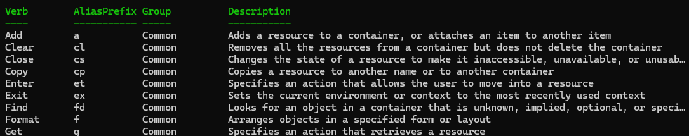</td>
      <td>75</td>
    </tr>
    <tr>
      <td><code>Get-Alias -Definition Get-Process</code></td>
      <td></td>
      <td>76</td>
    </tr>
    <tr>
      <td><code>(Get-Command Get-Process | select -Expand parameters).ErrorAction.aliases</code></td>
      <td>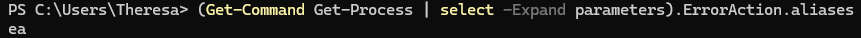</td>
      <td>76</td>
    </tr>
    <tr>
      <td><code>Move-Item -Path 'C:\path\PS Notes.txt' -Destination 'C:\new-path'</code></td>
      <td>-</td>
      <td>79</td>
    </tr>
  </tbody>
</table>

## Chapter 5 - Providers

A PowerShell provider or _PSProvider_ is an adapter. It's designed to take some kind of data storage, such as Windows Registry, Active Directory, or even the local filesystem, and make it look like a disk drive.

## TODO

- [ ] Read 4.7 after studying more about Azure Functions
